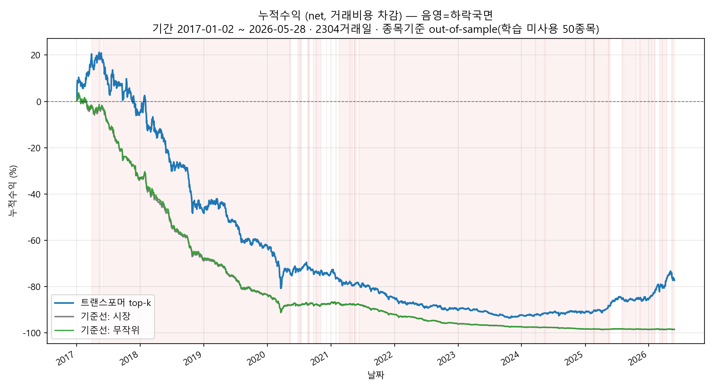
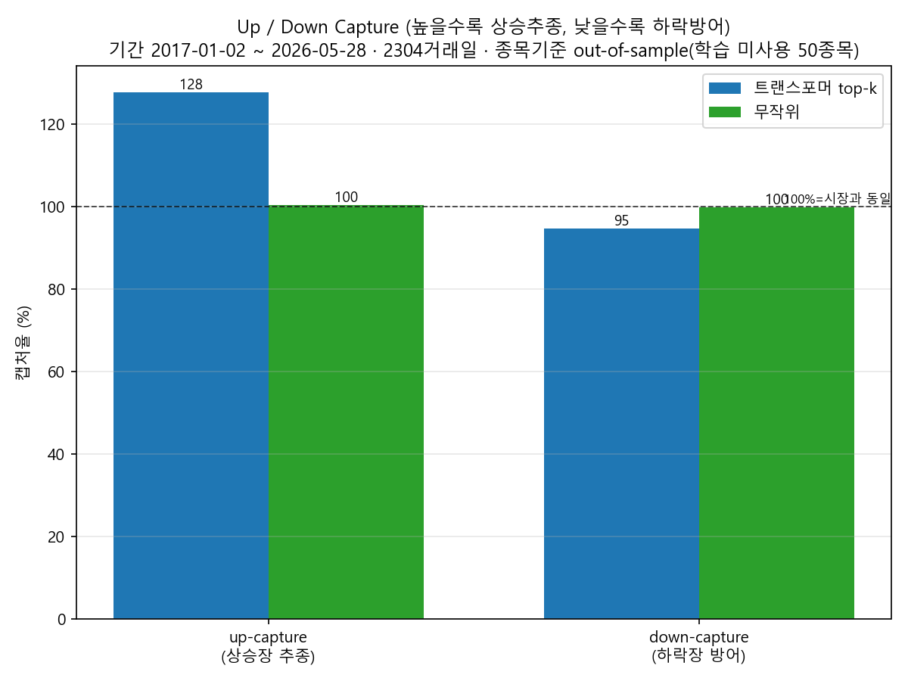
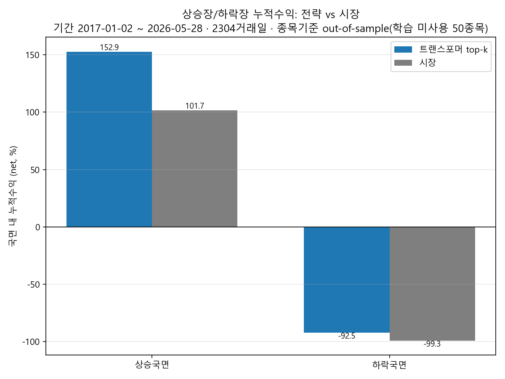

# KOSPI200 Transformer 주식 분석 파이프라인

> 졸업 캡스톤 프로젝트 — Transformer 기반 KOSPI200 상승확률 랭킹 + 수급 필터 + LLM 근거 설명

KIS(한국투자증권) API와 `pykrx` 데이터로 KOSPI200 후보 전체를 수집하고, Transformer
모델이 예측한 **다음날 상승확률 `P(up)`** 으로 전 종목을 랭킹한 뒤, 최근 외국인/기관
**수급 경향**이 좋은 종목만 추려 최종 Top10을 만들고, (선택) LLM이 뉴스 기반 근거를
덧붙이는 파이프라인입니다.

본 저장소의 핵심 기여는 **누수(leakage)를 차단한 검증 코드**입니다. 학습에 한 번도 쓰지
않은 50개 종목으로 다년 out-of-sample 백테스트를 수행해, 모델의 종목 선택력을 정직하게
측정합니다.

> ⚠️ **투자 조언이 아닙니다.** 이 코드는 학술/교육용 연구 결과물이며, 실제 매매 권유나
> 수익 보장이 아닙니다. 모든 투자 판단과 책임은 사용자 본인에게 있습니다.

---

## 파이프라인 개요

```text
[STEP 1] KOSPI200 후보 수집        main.py / KIS API
            │   거래대금 상위·등락률 필터로 후보 풀 구성
            ▼
[STEP 2] Transformer P(up) 랭킹     predict.py + model.py + data.py
            │   각 종목 20일 윈도우 → 상승확률 → 전체 랭킹
            │   최근 N거래일 외국인/기관 수급 경향 필터
            ▼
[STEP 3] (선택) LLM 근거 설명       stock_news_llm_sentiment.py
            │   네이버 뉴스 수집 → OpenAI/Gemini 요약·근거
            ▼
        최종 Top10 + 근거 (outputs/ CSV)
```

기본 실행은 STEP 1~2만 수행합니다. 뉴스 + LLM(STEP 3)은 `--run-news` 옵션을 줄 때만
실행되며 별도 API 키가 필요합니다.

---

## 모델 & 데이터 분할

- **모델**: `StockTransformer` — Time2Vec + Conv1D 투영 + TransformerEncoder(2-layer,
  d_model=64, nhead=4) + Global Average Pooling 헤드. 이진 분류(`P(up)`).
- **입력 피처(11종)**: 로그수익률(O/H/L/C), 거래량 z-score(인과적), RSI, MACD/Signal,
  볼린저 %B·정규화 밴드폭. 모두 `data.py`에서 누수 없이 계산.
- **데이터 분할(종목 기준 완전 분리)**: KOSPI200을 종목 단위로 나눠
  **train 120 / val 30 / test 50** 종목으로 split. 세 집합의 종목은 서로 겹치지 않습니다.
  따라서 test 50종목은 모델이 학습 중 **한 번도 본 적 없는 종목** = 종목 기준 out-of-sample.
- 체크포인트 `transformer_5y.pt` 는 5년치(2021-06~) 데이터로 학습된 분류 모델입니다.

---

## 검증 결과 (정직하게)

학습에 쓰지 않은 **test 50종목**으로 약 9년치(2017-01-02 ~ 2026-05-29, **2,304 거래일**)
out-of-sample 백테스트를 수행했습니다. 매 거래일 `P(up)` 상위 k=5 종목을 동일가중 매수,
다음날 종가로 청산하는 단순 전략이며, 기준선은 시장(50종목 동일가중)과 무작위 k입니다.
재현 스크립트: `backtest_long.py`, 요약: `outputs/backtest_long_summary.csv`.

### 전체 기간 누적수익



| 구분 | 트랜스포머 top-5 | 시장(동일가중) | 무작위 |
|---|---|---|---|
| **누적수익 (gross)** | **+70.9%** | +3.5% | +3.7% |
| 일평균수익 (gross) | +0.201% | +0.074% | +0.076% |
| 적중률 (gross) | 55.3% | 54.8% | 55.1% |
| 일간 샤프 (gross) | 0.114 | 0.057 | 0.059 |
| 최대낙폭 MDD (gross) | −42.7% | −52.9% | −53.0% |

→ **수수료 전(gross) 기준으로 트랜스포머가 시장을 약 20배(누적 +70.9% vs +3.5%)
앞섭니다.** 종목 선택 신호 자체에는 실질적인 정보가 있다는 의미입니다.

### 상승장 추종 + 하락장 방어 (Up/Down Capture)



| 지표 | 값 (net) | 해석 |
|---|---|---|
| **up-capture** | **127.6%** | 시장 상승일에 시장보다 28% 더 벌어들임(상승 추종 양호) |
| **down-capture** | **94.6%** | 시장 하락일에 시장 손실의 94.6%만 반영(소폭 방어) |

up-capture > 100% 이고 down-capture < 100% 인 형태는 "상승은 더 먹고 하락은 덜 잃는"
바람직한 비대칭을 뜻합니다.

### 추세 국면별 (60일 이동평균 기준)



시장 누적지수의 60일 이동평균 위=상승국면(276일), 아래=하락국면(1,969일)으로 라벨링.
(앞 59일은 MA 워밍업으로 라벨 미정.)

| 국면 | 트랜스포머 (net) | 시장 (net) |
|---|---|---|
| **상승국면** (276일) | **+152.9%** | +101.7% |
| 하락국면 (1,969일) | −92.5% | −99.3% |

상승국면에서 시장(+101.7%)을 크게 웃도는 **+152.9%** 를 기록했고, 길고 가혹한 하락국면
에서도 시장보다 손실이 작았습니다(gross 기준으로는 하락국면에서도 큰 폭 우위).

> 참고로 **단기(out-of-time) 백테스트**(`backtest_oot.py`, 최근 미관측 ~13거래일)는
> 소표본이라 음(−)의 결과가 나왔습니다(`outputs/oot_summary.csv`). 표본이 작을 때의
> 분산을 보여주는 정직한 보조 자료로 함께 둡니다.

---

## 한계 (정직하게)

- **거래비용에 의한 net 잠식**: 위 전략은 *매일 전 종목 리밸런싱*을 가정합니다. 왕복
  0.25% 비용을 2,304거래일에 적용하면 net 누적수익은 트랜스포머 −77%, 시장 −98.6%로
  **둘 다 크게 마이너스**가 됩니다. 즉 *일별 회전 전략은 비용 앞에서 비현실적*이며, gross
  우위를 실현하려면 회전율을 낮추거나 보유기간을 늘리는 등 비용 설계가 반드시 필요합니다.
- **수급 데이터의 30일 제한**: KIS `inquire-investor` 는 최근 약 30거래일만 제공하므로
  수급 필터는 다년 백테스트에 쓸 수 없습니다. 따라서 장기 백테스트는 **트랜스포머 단독**
  평가입니다(수급 효과 분리는 단기 `backtest_oot.py` 에서만 ablation으로 확인).
- **소표본·과적합 주의**: 단기 백테스트는 거래일이 매우 적고, 50종목이라는 한정된
  유니버스에서 얻은 결과입니다. 일반화에는 주의가 필요합니다.
- **모의투자(VTS) 환경**: KIS 모의투자 엔드포인트를 사용합니다. 실거래와 체결·가격이
  다를 수 있습니다.
- **투자 조언 아님**: 본 결과는 연구 목적이며 수익을 보장하지 않습니다.

---

## 폴더 구조

```text
.
├─ integrated_pipeline.py     # 기본 파이프라인 진입점 (STEP1~2, 선택적 STEP3)
├─ main.py                    # KOSPI200 후보 수집 (KIS API)
├─ config.py                  # KIS 인증/토큰 관리
├─ model.py                   # StockTransformer 모델 정의
├─ data.py                    # 누수 차단 피처 계산 / 윈도우 / 스케일러
├─ predict.py                 # 체크포인트 추론
├─ transformer_5y.pt          # 학습된 Transformer 체크포인트(분류)
│
├─ backtest_long.py           # ★ 장기 out-of-sample 백테스트 + 상승/하락장 분리
├─ backtest_oot.py            # ★ 단기 out-of-time 백테스트 + 수급 ablation
│
├─ stock_news_llm_sentiment.py            # (STEP3) 뉴스 수집 + LLM 근거
├─ integrated_stock_lstm_news_pipeline.py # (legacy) LSTM 비교 실험
├─ train_lstm_from_main_top10.py          # (legacy) LSTM 학습
├─ step5_save_backtest2.py                # (legacy) 구 백테스트
│
├─ shared_test_raw.parquet    # test 50종목 원시 OHLCV (재현용, 커밋 유지)
├─ figures/                   # README용 차트 (백테스트 산출 PNG 복사본)
├─ outputs/                   # 실행 산출물(CSV/PNG) — gitignore
├─ requirements.txt
├─ .env.example               # 환경변수 템플릿(값은 placeholder)
└─ .gitignore
```

> `shared_train_raw.parquet` / `shared_val_raw.parquet` 는 본 저장소에 포함되지 않습니다
> (test 재현에는 `shared_test_raw.parquet` 만 필요).

---

## 설치 & 실행

### 1) 환경 준비

```bash
# Python 3.10+ 권장
pip install -r requirements.txt
```

### 2) API 키 설정

`.env.example` 을 복사해 `.env` 를 만들고 값을 채웁니다. `.env` 는 `.gitignore` 로
무시되므로 커밋되지 않습니다.

```bash
copy .env.example .env      # Windows
# cp .env.example .env      # mac/linux
```

| 변수 | 필요 시점 |
|---|---|
| `APP_KEY`, `APP_SECRET` | 기본 파이프라인 (KIS) — **필수** |
| `NAVER_CLIENT_ID`, `NAVER_CLIENT_SECRET` | `--run-news` (뉴스) |
| `OPENAI_API_KEY` 또는 `GEMINI_API_KEY` | `--run-news` (LLM 근거) |

### 3) 기본 파이프라인 실행

```bash
python integrated_pipeline.py
```

기본값: `--candidate-pool 200`, `--supply-window 5`, `--supply-min-positive-days 3`,
`--final-max 10`. 뉴스+LLM까지: `python integrated_pipeline.py --run-news`.

### 4) 백테스트(검증) 재현

```bash
# 장기 out-of-sample (네트워크 불필요, shared_test_raw.parquet 만 사용)
python backtest_long.py                # --start 2017-01-01 --topk 5 --cost 0.25

# 단기 out-of-time (신선 데이터 pykrx 수집 + 수급 ablation, KIS 키 필요)
python backtest_oot.py                 # --topk 5 --cost 0.25  (또는 --no-supply)
```

산출물은 `outputs/` 에 PNG/CSV로 저장됩니다.

---

## 수급 통과 조건 (STEP 2 필터)

최근 `--supply-window` 거래일 기준 아래를 모두 만족하면 `supply_pass=True`:

- 외국인 순매수 합계 `> 0`, 기관 순매수 합계 `> 0`
- 외국인/기관 각각 순매수 양수인 날 `>= --supply-min-positive-days`
- 수급 데이터가 윈도우만큼 확보됨(`supply_data_enough=True`)

누수 방지: 수급 조회 기준일은 각 종목 OHLCV의 마지막(완료된) 거래일이며, 미래 데이터를
사용하지 않습니다.

---

## 출력 CSV (기본 파이프라인)

`outputs/` 에 저장됩니다.

- `step1_candidate_pool.csv` — KOSPI200 후보 풀
- `step2_all_transformer_rank.csv` — `P(up)` 전체 랭킹 (`ticker, company_name, p_up, pred_rank, transformer_base_date` 등)
- `step2_supply_checked.csv` — 랭킹 + 수급 경향 컬럼
- `step2_final_top10.csv` — 수급 통과 최종 Top10

예측/수급 실패는 파이프라인을 멈추지 않고 `prediction_status/error`, `supply_status/error`
컬럼에 기록됩니다.

---

## 라이선스 / 면책

학술·교육 목적의 캡스톤 결과물입니다. 본 코드와 결과는 **투자 조언이 아니며**, 어떤
금융 손익에 대해서도 책임지지 않습니다. KIS·네이버·OpenAI·Google 각 서비스의 이용약관을
준수하세요.
