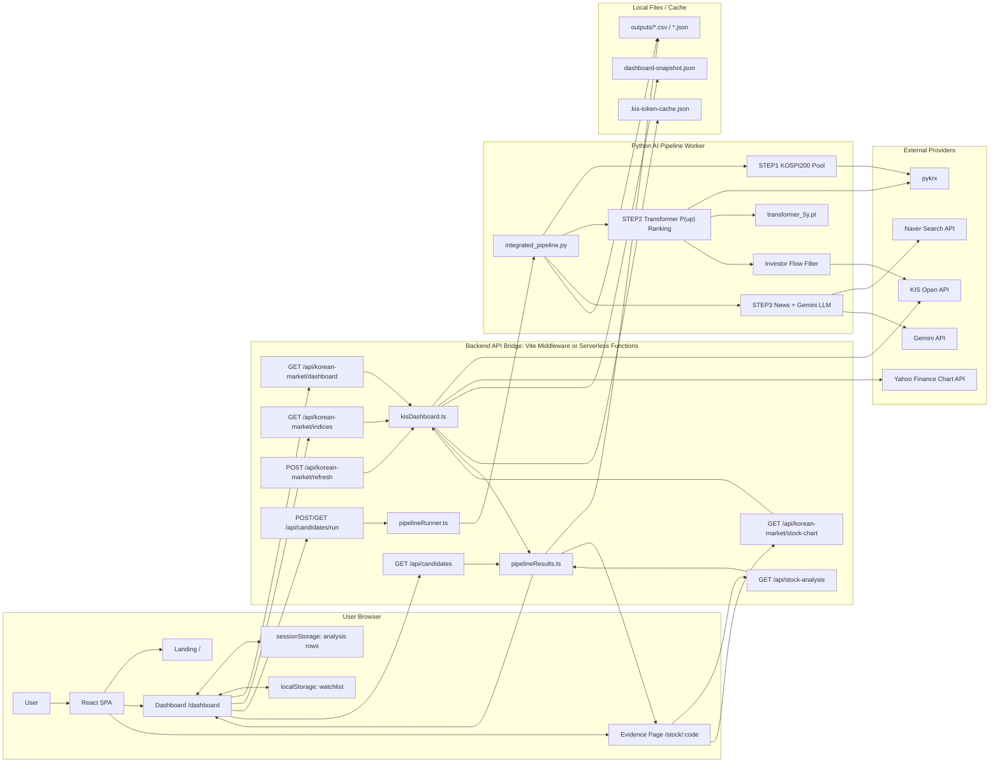

# KOSPI AI Trading Desk 서비스 아키텍처 설계 설명서

이 문서는 아키텍처 구조도 생성용 LLM에게 전달하기 위한 서비스 구조 설명서입니다. 목적은 화면, API, Python AI 파이프라인, 외부 데이터 소스, 산출물 저장소 사이의 관계를 명확하게 표현하는 것입니다.

## 1. 서비스 한 줄 설명

KOSPI AI Trading Desk는 KOSPI200 전체 종목을 대상으로 Transformer 모델이 단기 상승 확률을 예측하고, 외국인·기관 수급, 거래량 변화, 최신 뉴스 감정, Gemini LLM 종합 판단을 결합해 상승 가능성이 높은 단기 후보 종목을 대시보드와 근거 리포트로 보여주는 웹 서비스입니다.

## 2. 전체 시스템 경계

구조도는 아래 6개 영역으로 나누어 표현하면 좋습니다.

1. 사용자 브라우저
   - React SPA 화면을 사용합니다.
   - 랜딩 페이지, 대시보드, 종목별 근거 보기 페이지로 이동합니다.

2. Frontend SPA
   - React + TypeScript + Vite 기반입니다.
   - 주요 경로는 `/`, `/dashboard`, `/stock/:code` 입니다.
   - API 응답을 받아 시장 지수 카드, AI 후보 목록, 진행 상태, 종목 상세 리포트를 렌더링합니다.
   - 후보 분석 결과는 뒤로가기 유지용으로 `sessionStorage`에 저장합니다.
   - 관심 종목은 `localStorage`에 저장합니다.

3. Backend API Bridge
   - 개발 환경에서는 Vite dev server middleware가 API 역할을 합니다.
   - 배포 환경에서는 `FE/api/**` 서버리스 함수로 같은 역할을 할 수 있습니다.
   - 브라우저가 KIS, Naver, Gemini API를 직접 호출하지 않도록 중간 계층 역할을 합니다.
   - KIS API 키, Gemini API 키, Naver API 키는 서버 환경변수에만 둡니다.

4. Python AI Pipeline Worker
   - `integrated_pipeline.py`가 전체 분석을 오케스트레이션합니다.
   - STEP1: KOSPI200 후보 풀 생성
   - STEP2: pykrx OHLCV 수집, Transformer 상승 확률 예측, 외국인·기관 수급 첨부
   - STEP3: Naver 뉴스 수집, Gemini LLM 종합 분석
   - 최종 결과를 `outputs/` 폴더의 CSV/JSON 파일로 저장합니다.

5. External Data / AI Providers
   - KIS 한국투자증권 Open API: 현재가, 지수, 투자자 수급, 종목 차트, OAuth 토큰
   - pykrx: KOSPI200 종목 및 OHLCV 일봉 데이터
   - Naver Search API: 종목별 최신 뉴스 수집
   - Gemini API: 뉴스와 STEP2 정량 데이터를 종합 분석
   - Yahoo Finance Chart API: KOSPI/KOSDAQ/KOSPI200 최근 지수 일봉 흐름 보조 데이터

6. Local Files / Cache Storage
   - `outputs/`: Python 파이프라인 산출물 저장
   - `transformer_5y.pt`: 학습된 Transformer 모델 체크포인트
   - `.kis-token-cache.json`: KIS OAuth 토큰 캐시
   - `FE/server/cache/dashboard-snapshot.json`: 대시보드 KIS 스냅샷 캐시
   - Browser `sessionStorage`: 분석 결과 화면 유지
   - Browser `localStorage`: 관심 종목 유지

## 3. 주요 화면 구조

### 3.1 Landing Page `/`

사용자에게 서비스 컨셉과 AI 분석 흐름을 소개하는 첫 화면입니다. 실제 분석 결과 목록은 기본적으로 대시보드에서 AI 분석을 실행한 뒤 표시합니다.

구조도에서는 "User Browser -> React Landing Page" 정도로 간단히 표현하면 됩니다.

### 3.2 Dashboard Page `/dashboard`

핵심 운영 화면입니다.

대시보드가 표시하는 주요 정보:

- KOSPI200 대표 지수 카드
- KOSPI 시장 국면 카드
- AI 후보 분석 설명 카드
- AI 분석 시작 버튼
- 분석 진행률 상태
- 최종 후보 종목 목록
- 각 후보의 현재가, 등락률, 종합 점수, 상승/중립 판단
- 선정근거 버튼

주요 컴포넌트:

- `FE/src/pages/DashboardPage.tsx`
- `FE/src/components/market/MarketWorkspace.tsx`
- `FE/src/components/market/AnalysisResults.tsx`

### 3.3 Stock Detail Page `/stock/:code`

후보 종목의 "선정근거" 화면입니다.

표시 정보:

- 종목 현재가와 가격 차트
- AI 핵심 근거
- 최종 결합 점수
- Transformer 상승 확률
- 뉴스 분석 점수
- 외국인·기관 수급 합산
- 뉴스 감성 비율
- 카테고리별 근거 점수
- 외국인/기관 순매수 흐름
- 분석에 사용한 뉴스 목록과 긍정/중립/부정 분류

주요 컴포넌트:

- `FE/src/pages/StockDetailPage.tsx`
- `FE/src/components/market/stock-chart/StockChartPanel.tsx`
- `FE/src/components/market/CandleChart.tsx`

## 4. 주요 API 엔드포인트

구조도에서는 `Backend API Bridge` 박스 내부에 아래 엔드포인트를 배치하면 됩니다.

### 4.1 `GET /api/korean-market/dashboard`

대시보드 전체 데이터를 반환합니다.

처리 흐름:

1. `FE/server/kisDashboard.ts`의 `buildKisDashboard()` 실행
2. 신선한 스냅샷이 있으면 즉시 반환
3. 오래된 스냅샷이라도 있으면 우선 반환하고 백그라운드 갱신 시작
4. 스냅샷이 없으면 KIS API로 일부 종목을 인라인 조회
5. 이후 전 종목 스냅샷 워밍 작업 실행

반환 데이터:

- `indices`
- `stocks`
- `watchlist`
- `focusedStockCode`
- `events`
- `sessionLabel`

### 4.2 `GET /api/korean-market/indices`

지수 카드용 최신 지수 데이터를 반환합니다.

처리 흐름:

1. KIS 지수 현재값과 전일 대비 등락률 조회
2. Yahoo Finance에서 최근 1개월 일봉 종가 시계열 조회
3. 시계열 마지막 값을 KIS 현재값으로 보정
4. `miniSeries`로 프론트에 전달

대상 지수:

- KOSPI
- KOSDAQ
- KOSPI200

### 4.3 `POST /api/korean-market/refresh`

대시보드 스냅샷 갱신 배치입니다.

처리 흐름:

1. KIS API로 KOSPI200 종목 현재가 조회
2. 설정에 따라 외국인·기관 수급 조회
3. 기존 파이프라인 결과가 있으면 종목별 AI 필드 병합
4. `FE/server/cache/dashboard-snapshot.json`에 저장

### 4.4 `GET /api/korean-market/stock-chart?symbol=000660`

종목 상세 페이지 차트용 데이터입니다.

처리 흐름:

1. KIS 현재가 조회
2. KIS 일봉/분봉 차트 데이터 조회
3. 가격, 캔들, 거래량, 요약 지표를 프론트 형식으로 정규화

### 4.5 `POST /api/candidates/run`

사용자가 "AI 분석 시작" 버튼을 눌렀을 때 호출합니다.

중요한 특징:

- HTTP 요청이 끝날 때까지 Python 분석을 기다리지 않습니다.
- 백그라운드에서 Python 프로세스를 실행하고 즉시 상태를 반환합니다.
- 긴 분석 중 Cloudflare Tunnel 또는 브라우저 타임아웃을 피하기 위한 구조입니다.

처리 흐름:

1. `FE/server/pipelineRunner.ts`의 `startCandidateAnalysis()` 실행
2. 이미 실행 중이면 기존 실행 상태에 재연결
3. 실행 중이 아니면 `integrated_pipeline.py`를 Python child process로 실행
4. stdout/stderr 로그를 읽어 진행률 단계로 변환
5. 완료 후 결과 파일 존재 여부와 최신 수정 시간을 검증
6. `getCandidatesPayload()`로 결과를 읽어 대시보드 표시용으로 변환

### 4.6 `GET /api/candidates/run`

AI 분석 진행 상태 polling API입니다.

상태값:

- `idle`
- `running`
- `completed`
- `failed`

진행 단계:

1. 실행 준비
2. KOSPI200 후보 풀 로드
3. OHLCV 수집·Transformer 예측
4. 외국인·기관 수급 조회
5. 뉴스 크롤링
6. Gemini LLM 종합 판단
7. 결과 파일 검증

### 4.7 `GET /api/candidates`

최종 후보 목록을 반환합니다.

처리 흐름:

1. `outputs/step2_final_top10.csv`를 우선 읽음
2. `outputs/step3_final_news_llm_analysis.json` 또는 `news_gemini_result.json`이 있으면 뉴스/LLM 결과를 종목코드 기준으로 병합
3. Gemini 최종 판단이 POSITIVE 또는 NEUTRAL인 종목만 표시 가능 후보로 사용
4. LLM 종합 점수와 Transformer 순위 기준으로 정렬

### 4.8 `GET /api/stock-analysis?ticker=000660`

종목별 근거 보기 화면의 AI 분석 데이터를 반환합니다.

처리 흐름:

1. Top10 결과에서 해당 종목 검색
2. 없으면 `step2_all_transformer_rank.csv` 전체 랭킹에서 검색
3. 뉴스/LLM 결과가 있으면 병합
4. 상세 페이지에서 근거 리포트로 시각화

## 5. Python AI 파이프라인 구조

### 5.1 오케스트레이터: `integrated_pipeline.py`

전체 분석의 진입점입니다.

입력:

- KIS API 키
- Naver API 키
- Gemini API 키
- `transformer_5y.pt`
- `main.py`
- `predict.py`
- 파라미터: 후보 수, Top N, OHLCV lookback, 수급 기간, 뉴스 수

출력:

- `outputs/step1_candidate_pool.csv`
- `outputs/step2_all_transformer_rank.csv`
- `outputs/step2_supply_checked.csv`
- `outputs/step2_final_top10.csv`
- `outputs/step2_transformer_supply_demand.csv`
- `outputs/step3_final_news_llm_analysis.json`
- `outputs/step3_final_news_llm_analysis.csv`

### 5.2 STEP1: KOSPI200 후보 풀 로드

담당 파일:

- `main.py`
- `integrated_pipeline.py`

처리 내용:

1. pykrx 또는 내장 KOSPI200 풀에서 종목코드와 종목명을 로드
2. 중복과 비정상 코드를 제거
3. 최대 200개 후보 풀 생성
4. `step1_candidate_pool.csv` 저장

### 5.3 STEP2: Transformer 상승 확률 예측과 수급 첨부

담당 파일:

- `data.py`
- `model.py`
- `predict.py`
- `integrated_pipeline.py`
- `transformer_5y.pt`

처리 내용:

1. pykrx에서 종목별 OHLCV 일봉 데이터 조회
2. `data.py`에서 RSI, MACD, Bollinger, 로그수익률, 거래량 z-score 등 피처 계산
3. `model.py`의 StockTransformer 구조로 추론
4. `predict.py`가 각 종목의 상승 확률 `p_up` 계산
5. KOSPI200 전체를 `p_up` 내림차순으로 랭킹
6. Top10 후보에 대해 KIS 투자자별 매매 동향 조회
7. 외국인/기관 순매수 합계, 순매수 우위 일수, supply_pass, supply_score 계산
8. `step2_final_top10.csv` 저장

### 5.4 STEP3: Naver 뉴스 수집과 Gemini LLM 종합 판단

담당 파일:

- `crolling.py`
- `integrated_pipeline.py`
- 보조/레거시: `stock_news_llm_sentiment.py`

처리 내용:

1. `step2_final_top10.csv`를 입력으로 읽음
2. 종목명 기반으로 Naver Search API 뉴스 검색
3. 최근 뉴스 제목과 요약을 수집
4. STEP2 정량 데이터와 뉴스 목록을 Gemini 프롬프트에 함께 전달
5. Gemini가 종목별 최종 방향성, 뉴스 점수, 최종 결합 점수, 요약, 핵심 근거, 기사별 감성을 JSON으로 반환
6. LLM 호출은 기본 동시 3개 병렬 처리
7. 결과를 JSON과 CSV로 저장

LLM 판단 기준:

- Transformer 모델 상승 확률
- Transformer 예측 순위
- 외국인 순매수 합계
- 기관 순매수 합계
- 외국인/기관 매수 우위 일수
- supply_pass/supply_score
- 최신 뉴스의 호재/악재/중립성
- 리스크 요인

## 6. 프론트엔드 데이터 병합 흐름

### 6.1 대시보드 최초 진입

1. 사용자가 `/dashboard` 진입
2. `DashboardPage.tsx`가 `getMarketDashboardData()` 호출
3. 브라우저 캐시 또는 mock dashboard를 먼저 보여줌
4. 동시에 `fetchMarketIndicesData()`로 최신 지수만 별도 갱신
5. KIS 지수 현재값과 최근 일봉 miniSeries가 화면에 반영됨

### 6.2 AI 분석 시작

1. 사용자가 "AI 분석 시작" 버튼 클릭
2. 프론트가 `POST /api/candidates/run` 호출
3. 서버가 Python `integrated_pipeline.py` 실행
4. 프론트는 `GET /api/candidates/run`을 반복 호출해 진행 상태 표시
5. 진행 상태는 Python 로그 문자열을 기반으로 stage와 percent로 변환됨
6. 완료되면 `GET /api/candidates` 호출
7. `step2_final_top10.csv`와 STEP3 JSON을 병합한 최종 후보 rows를 받음
8. 후보 rows를 `overlayLiveAnalysis()`로 대시보드 데이터에 덮어씀
9. 후보 목록을 종합 점수 순으로 표시
10. rows를 `sessionStorage`에 저장해 근거 보기 후 뒤로가기를 해도 목록이 유지됨

### 6.3 선정근거 보기

1. 사용자가 후보의 "선정근거" 버튼 클릭
2. `/stock/:code`로 이동
3. 상세 페이지가 `GET /api/stock-analysis?ticker={code}` 호출
4. 종목별 LLM/뉴스/수급/모델 결과를 받아 `AiCandidate`로 변환
5. 동시에 KIS 종목 차트 API로 가격 차트 조회
6. 근거 리포트 대시보드 형태로 표시

## 7. 데이터 저장소와 파일 의존성

구조도에서 별도 "File Storage / Cache" 그룹으로 표현하면 좋습니다.

### 7.1 모델 파일

- `transformer_5y.pt`
- Transformer 추론에 사용하는 체크포인트입니다.

### 7.2 파이프라인 산출물

- `outputs/step1_candidate_pool.csv`
- `outputs/step2_all_transformer_rank.csv`
- `outputs/step2_supply_checked.csv`
- `outputs/step2_final_top10.csv`
- `outputs/step2_transformer_supply_demand.csv`
- `outputs/step3_final_news_llm_analysis.json`
- `outputs/step3_final_news_llm_analysis.csv`

프론트 표시에서 특히 중요한 파일:

- `step2_final_top10.csv`: Transformer Top10, 수급, 모델 점수
- `step3_final_news_llm_analysis.json`: Gemini가 분석한 뉴스/최종 점수/근거
- `step3_final_news_llm_analysis.csv`: 검증용 CSV 요약

### 7.3 대시보드 스냅샷 캐시

- `FE/server/cache/dashboard-snapshot.json`
- KIS API 호출이 느리므로 대시보드 전체 종목 현재가와 수급을 미리 저장합니다.
- 신선한 캐시가 있으면 화면 로딩이 빠릅니다.

### 7.4 KIS 토큰 캐시

- `.kis-token-cache.json`
- KIS OAuth access token을 저장합니다.
- 서버 계층에서만 사용합니다.

### 7.5 브라우저 저장소

- `sessionStorage`
  - 키: `kospi-dashboard-analysis.v1`
  - AI 분석 결과 rows를 임시 저장해 뒤로가기 시 목록을 유지합니다.

- `localStorage`
  - 키: `kospi-watchlist.v1`
  - 관심 종목 코드를 저장합니다.

## 8. 보안 설계

1. 브라우저는 KIS, Naver, Gemini API를 직접 호출하지 않습니다.
2. API 키와 시크릿은 `.env` 또는 서버 환경변수에만 저장합니다.
3. `.env`는 Git에 커밋하지 않습니다.
4. 프론트에는 정규화된 결과 JSON만 내려줍니다.
5. 분석 실패 시 사용자에게는 파일 경로나 API 키가 포함되지 않은 공개 오류 메시지만 표시합니다.
6. 긴 Python 로그는 서버 콘솔에서만 확인하고, UI에는 단계/진행률/요약 메시지만 표시합니다.

## 9. 장애 대응과 fallback

1. KIS 대시보드 API가 느리거나 실패하면 기존 스냅샷 또는 mock 데이터를 표시합니다.
2. 지수 현재값은 KIS를 우선 사용합니다.
3. 지수 최근 흐름은 Yahoo Finance를 보조로 사용하고, 실패하면 KIS 전일 대비 보간 miniSeries로 fallback합니다.
4. Python 분석 중 브라우저 요청이 끊겨도 서버의 background job은 계속 실행됩니다.
5. 분석 완료 후 프론트가 polling 연결을 잃어도 `GET /api/candidates`로 outputs 파일을 다시 읽어 결과를 복구합니다.
6. LLM 결과가 없으면 STEP2 Transformer CSV만으로 후보 정보를 표시할 수 있습니다.

## 10. 구조도에 넣을 권장 컴포넌트

아키텍처 그림을 그릴 때 아래 박스와 화살표를 사용하면 됩니다.

### 사용자/프론트 영역

- User Browser
- React SPA
- Landing Page
- Dashboard Page
- Stock Detail Evidence Page
- sessionStorage
- localStorage

### API 영역

- Vite Dev Server / Serverless API Bridge
- `/api/korean-market/dashboard`
- `/api/korean-market/indices`
- `/api/korean-market/stock-chart`
- `/api/korean-market/refresh`
- `/api/candidates/run`
- `/api/candidates`
- `/api/stock-analysis`

### Python 분석 영역

- integrated_pipeline.py
- STEP1 KOSPI200 Pool Loader
- STEP2 Transformer Predictor
- Investor Flow Filter
- STEP3 News Crawler + Gemini LLM
- crolling.py
- predict.py
- model.py / data.py

### 외부 연동 영역

- KIS Open API
- pykrx
- Naver Search API
- Gemini API
- Yahoo Finance Chart API

### 저장소 영역

- outputs CSV/JSON
- Transformer checkpoint
- Dashboard snapshot cache
- KIS token cache

## 11. 핵심 데이터 흐름

### 11.1 실시간 시장 데이터 흐름

```text
Browser Dashboard
  -> GET /api/korean-market/dashboard
  -> Backend API Bridge
  -> Dashboard snapshot cache 확인
  -> 필요 시 KIS Open API 현재가/수급 조회
  -> pipelineResults가 outputs 결과 병합
  -> MarketDashboardData 반환
  -> React Dashboard 렌더링
```

### 11.2 지수 카드 데이터 흐름

```text
Browser Dashboard
  -> GET /api/korean-market/indices
  -> Backend API Bridge
  -> KIS Open API에서 현재 지수값/전일 대비 조회
  -> Yahoo Finance에서 최근 1개월 지수 일봉 조회
  -> miniSeries 생성
  -> React 지수 카드 그래프 렌더링
```

### 11.3 AI 후보 분석 흐름

```text
User clicks "AI 분석 시작"
  -> POST /api/candidates/run
  -> pipelineRunner starts Python child process
  -> integrated_pipeline.py
  -> STEP1 KOSPI200 후보 풀
  -> STEP2 pykrx OHLCV + Transformer P(up) + KIS 수급
  -> STEP3 Naver News + Gemini LLM
  -> outputs/step2_final_top10.csv
  -> outputs/step3_final_news_llm_analysis.json,csv
  -> Frontend polls GET /api/candidates/run
  -> completed
  -> GET /api/candidates
  -> pipelineResults merges step2 + step3
  -> React candidate list displays ranked results
```

### 11.4 근거 보기 흐름

```text
User clicks "선정근거"
  -> React Router /stock/:code
  -> GET /api/stock-analysis?ticker={code}
  -> Read outputs step2/step3 for selected ticker
  -> GET /api/korean-market/stock-chart?symbol={code}
  -> KIS stock chart data
  -> Stock Detail Page renders score, news, supply, chart evidence
```

## 12. Mermaid 초안

아래 Mermaid는 구조도 생성 LLM에게 참고용으로 줄 수 있는 간단한 초안입니다.



## 13. 구조도 생성용 프롬프트

아래 프롬프트를 LLM에게 그대로 전달하면 됩니다.

```text
KOSPI AI Trading Desk 서비스의 아키텍처 구조도를 그려줘.

서비스는 KOSPI200 전체 종목을 대상으로 Transformer 모델이 단기 상승 확률을 예측하고, 외국인·기관 수급, 거래량 변화, 최신 뉴스 감정, Gemini LLM 종합 판단을 결합해 상승 가능성이 높은 단기 후보 종목을 웹 대시보드와 근거 리포트로 보여주는 시스템이다.

구조도는 다음 6개 영역으로 나눠줘.

1. User Browser
- User
- React SPA
- Landing Page /
- Dashboard Page /dashboard
- Stock Detail Evidence Page /stock/:code
- sessionStorage: 분석 결과 유지
- localStorage: 관심 종목 유지

2. Frontend / API Bridge
- React + TypeScript + Vite
- 개발 환경에서는 Vite middleware가 API 역할
- 배포 환경에서는 FE/api 서버리스 함수가 같은 역할
- 브라우저는 KIS, Naver, Gemini API를 직접 호출하지 않고 API Bridge만 호출

3. Backend API Endpoints
- GET /api/korean-market/dashboard: 대시보드 전체 데이터
- GET /api/korean-market/indices: KIS 지수 현재값 + Yahoo 최근 일봉 miniSeries
- POST /api/korean-market/refresh: KIS 전 종목 스냅샷 갱신
- GET /api/korean-market/stock-chart: 종목 상세 차트
- POST /api/candidates/run: integrated_pipeline.py 백그라운드 실행 시작
- GET /api/candidates/run: 분석 진행률 polling
- GET /api/candidates: step2/step3 outputs 기반 최종 후보 목록
- GET /api/stock-analysis: 종목별 근거 보기 데이터

4. Python AI Pipeline Worker
- integrated_pipeline.py가 전체 오케스트레이션
- STEP1 KOSPI200 후보 풀 로드
- STEP2 pykrx OHLCV 수집, data.py 피처 계산, model.py StockTransformer, predict.py P(up) 추론, KIS 외국인·기관 수급 첨부
- STEP3 crolling.py가 Naver 뉴스 수집 후 Gemini API로 뉴스와 STEP2 정량 데이터를 종합 분석
- LLM 호출은 기본 3개 병렬 처리

5. External Providers
- KIS Open API: OAuth token, 현재가, 지수, 투자자 수급, 종목 차트
- pykrx: KOSPI200 종목/일봉 OHLCV
- Naver Search API: 최신 뉴스
- Gemini API: LLM 종합 판단
- Yahoo Finance Chart API: KOSPI/KOSDAQ/KOSPI200 최근 지수 일봉 흐름

6. Local Files / Cache
- transformer_5y.pt: 학습된 Transformer 체크포인트
- outputs/step1_candidate_pool.csv
- outputs/step2_all_transformer_rank.csv
- outputs/step2_final_top10.csv
- outputs/step2_transformer_supply_demand.csv
- outputs/step3_final_news_llm_analysis.json
- outputs/step3_final_news_llm_analysis.csv
- dashboard-snapshot.json: KIS 대시보드 스냅샷
- .kis-token-cache.json: KIS OAuth 토큰 캐시

핵심 데이터 흐름은 다음과 같다.

실시간 대시보드:
Browser Dashboard -> GET /api/korean-market/dashboard -> dashboard snapshot cache 확인 -> 필요 시 KIS API 조회 -> outputs AI 결과 병합 -> React Dashboard 렌더링

지수 카드:
Browser Dashboard -> GET /api/korean-market/indices -> KIS 현재 지수값 조회 -> Yahoo 최근 일봉 시계열 조회 -> miniSeries 생성 -> 지수 카드 그래프 렌더링

AI 분석:
User clicks AI 분석 시작 -> POST /api/candidates/run -> pipelineRunner.ts가 Python child process로 integrated_pipeline.py 실행 -> STEP1 후보 풀 -> STEP2 Transformer P(up) + 수급 -> STEP3 Naver 뉴스 + Gemini LLM -> outputs CSV/JSON 저장 -> Frontend가 GET /api/candidates/run으로 진행률 polling -> 완료 후 GET /api/candidates로 최종 후보 조회 -> 대시보드 후보 목록 표시

근거 보기:
User clicks 선정근거 -> /stock/:code -> GET /api/stock-analysis?ticker=code -> outputs step2/step3에서 해당 종목 분석 로드 -> GET /api/korean-market/stock-chart로 KIS 가격 차트 조회 -> 종합 점수, 뉴스 감성, 수급, Transformer 확률, 사용 뉴스 목록을 대시보드형 리포트로 표시

보안 제약:
API 키와 시크릿은 서버 환경변수에만 있고 브라우저에 노출되지 않는다. 프론트는 정규화된 JSON만 받는다.

그림 스타일은 마이크로서비스 아키텍처 다이어그램처럼 영역별 dashed boundary를 사용하고, 데이터 흐름 화살표를 왼쪽에서 오른쪽으로 배치해줘. External Providers와 Local Files/Cache는 하단 또는 우측에 별도 그룹으로 배치해줘.
```
